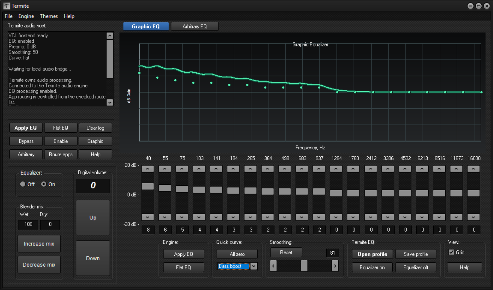
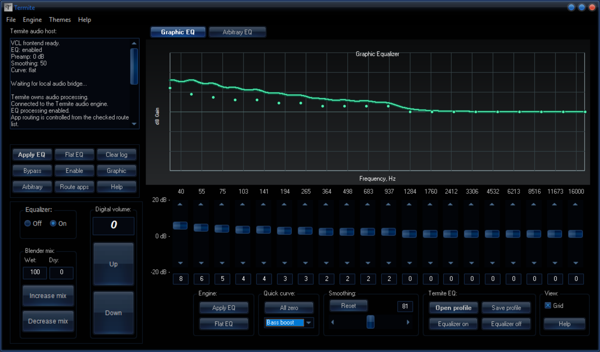
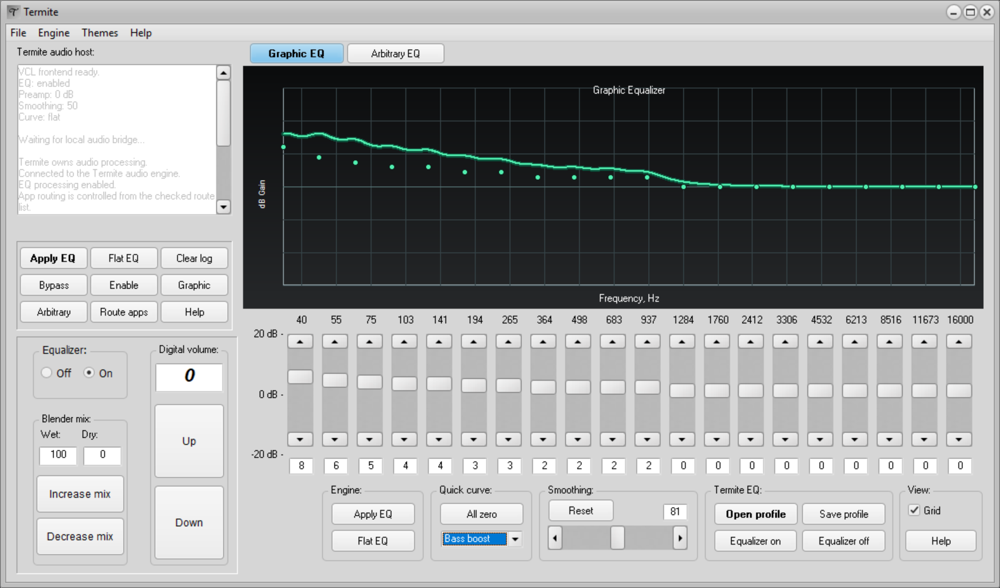
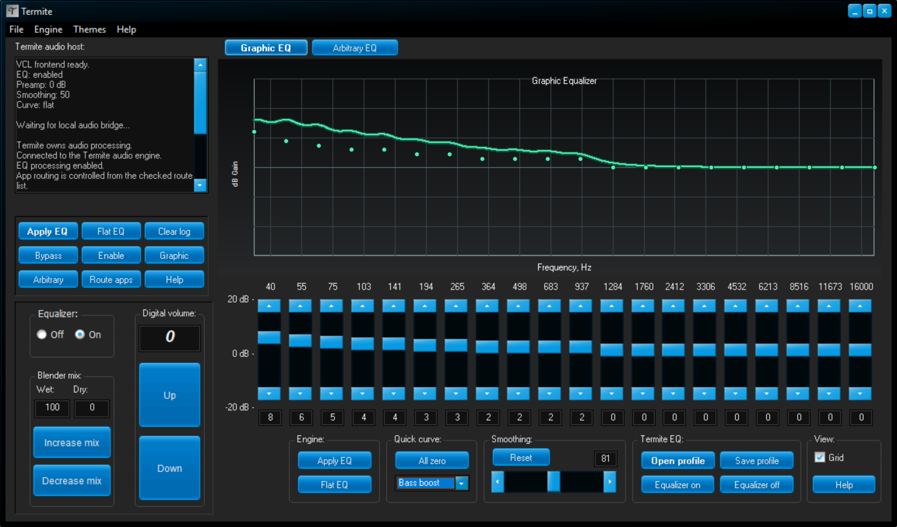
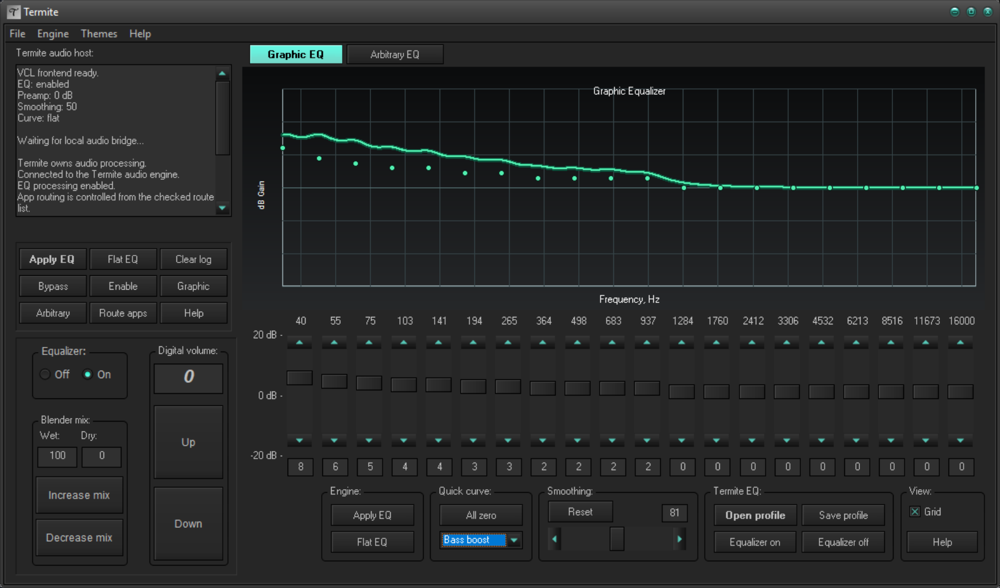

# Termite

Termite is a Windows equalizer for audio sent through VB-CABLE.

It has a 20-band graphic equalizer, an arbitrary equalizer, `.tsf` profiles,
and per-application routing.

## Themes

| Glossy | Cobalt XE Media |
| --- | --- |
|  |  |

| Aqua Light Slate | Aqua Graphite |
| --- | --- |
|  |  |

| Amakrits |
| --- |
|  |

## Running it

Install [VB-CABLE](https://vb-audio.com/Cable/) first. Windows should show
`CABLE Input` and `CABLE Output` afterwards.

Start `Termite.exe`, then use **Route apps** to send an application to
`CABLE Input`. Start playback before opening the route list; Windows only
lists applications with an active audio session.

Do not use `CABLE Input` as the default playback device. It will feed the
cable back into itself.

## Building

Build the host from the repository root:

```powershell
cmake -S . -B build
cmake --build build --target termite --parallel
```

Open [ui/TermiteUI.dproj](ui/TermiteUI.dproj) in Delphi and build
**Debug | Win64**. This creates `build\TermiteUI.exe`.

Build the host once more to put the frontend beside it:

```powershell
cmake --build build --target termite --parallel
```

Run the tests with:

```powershell
cmake --build build --target termite_dsp_tests termite_audio_tests termite_eq_bridge_tests --parallel
ctest --test-dir build --output-on-failure
```

## Packaging

```powershell
powershell -ExecutionPolicy Bypass -File .\tools\make_release.ps1
```

The ZIP is written to `release\Termite-win64.zip`.

## Layout

```
host/       C++ process and pipe server
sound/      WASAPI, routing, and EQ code
ui/         Delphi frontend
assets/     icon and artwork
tests/      native tests
tools/      release scripts
```

## License

Termite is MIT licensed. VB-CABLE is separate software from VB-Audio.
